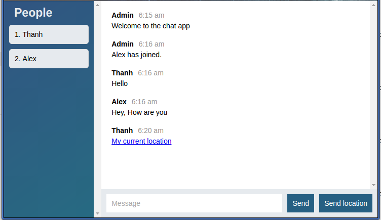

Node.JS Chat App
================

A chat/messenger app, which provides some real-time Messenger's basic features such as room chat, send location, auto-scrolling. The project is developed with multiple technologies including Node.js, Socket.io, jQuery, Moment, Mustache.js, HTML, CSS, etc.


URL: [https://lit-crag-58434.herokuapp.com/](https://lit-crag-58434.herokuapp.com/)



Features
--------

- Room chat
- Location sending
- Auto-scrolling
- Private messaging
- Other awesome features yet to be implemented

Built With
----------

* Node.js 
* Socket.io
* jQuery
* Moment
* Mustache.js
* HTML
* CSS

Setup
-----

Clone this repo to your desktop

```
$ cd node-chat-app
$ npm install 			# Install all the dependencies.
```

Usage
-----

After you clone this repo to your desktop, go to its root directory and run `npm install` to install its dependencies.

Once the dependencies are installed, you can run  `npm start` to start the application. You will then be able to access it at localhost:3000

You need to fill in Display name and Room name, so that you can enter the room chat. You can open another tab in the browser to enter the same room to chat.

test4
